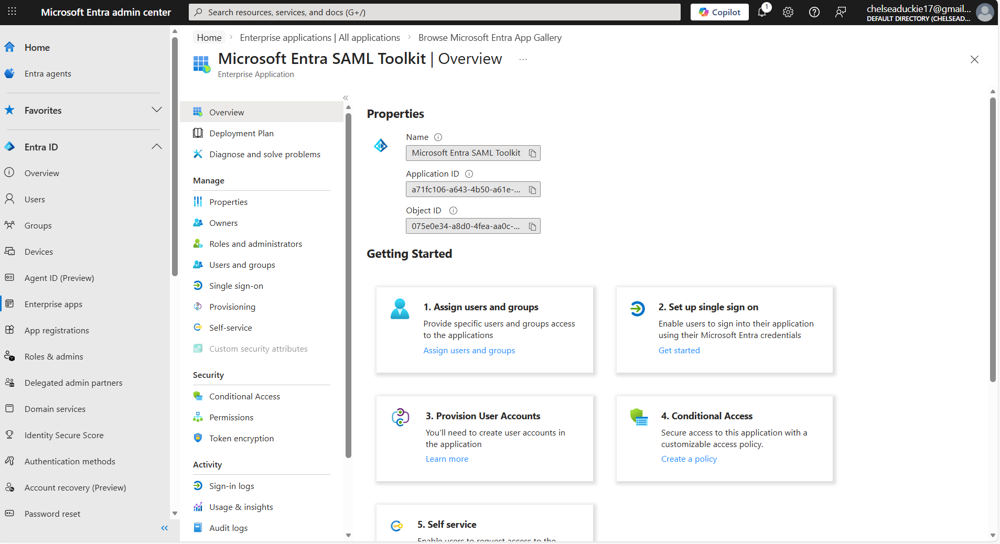
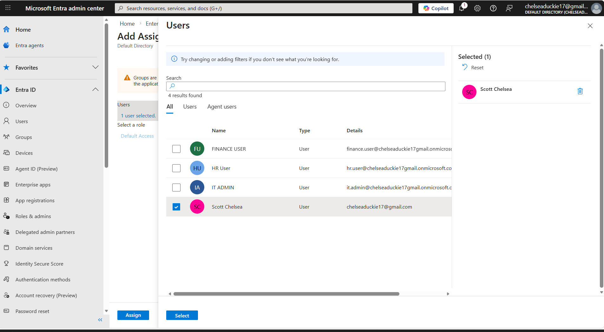
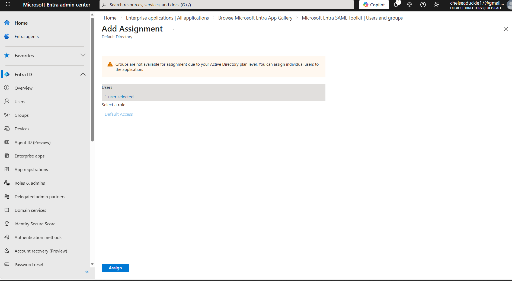
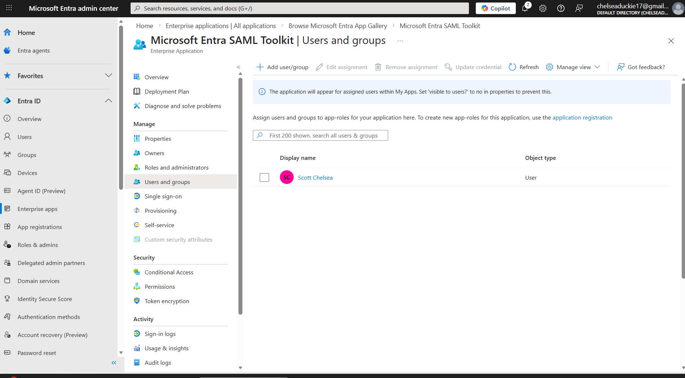
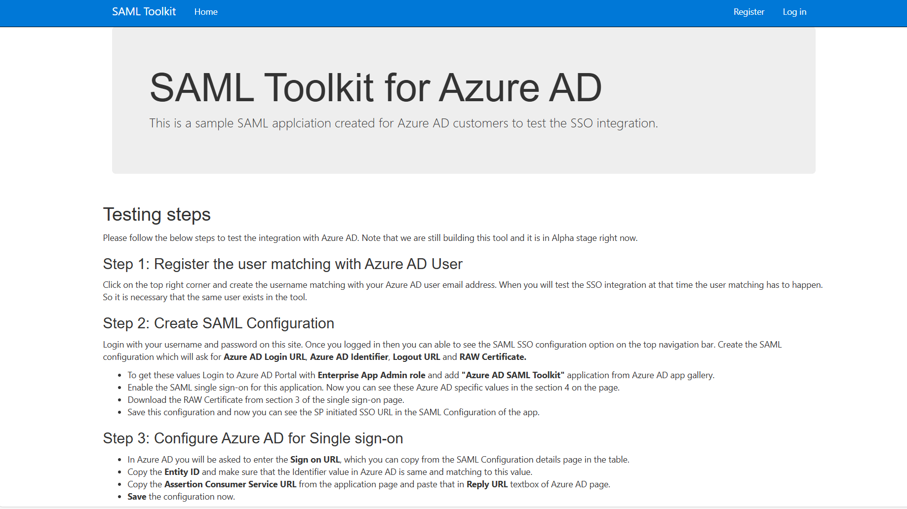
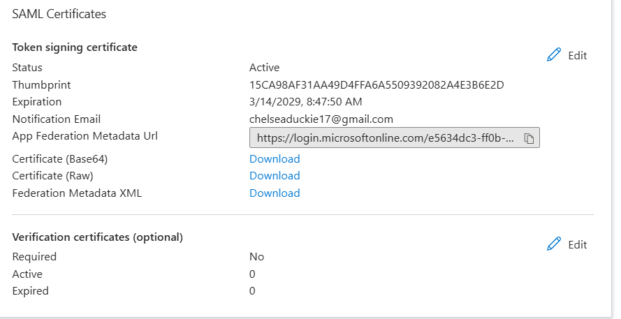

# Microsoft Entra ID SAML Single Sign-On Lab

This lab demonstrates how to configure SAML-based Single Sign-On (SSO) using Microsoft Entra ID.

The objective was to create an enterprise application, assign a user, configure SAML authentication settings, and test the SSO login.

---

## Tools Used
Microsoft Entra ID (Azure AD)

---

## Lab Steps

1. Created an Enterprise Application using the Microsoft Entra SAML Toolkit.
2. Assigned a user account to the enterprise application.
3. Enabled SAML authentication.
4. Configured Identifier, Reply URL, and Sign-on URL.
5. Tested the Single Sign-On authentication process.

---

## Enterprise Application Created

## User Selected for Assignment

## User Ready for Assignment

## User Successfully Assigned

## SAML Selected as Authentication Method

## Basic SAML Configuration

## Successful SAML SSO Test

## Token Signing Certificate

---

## Skills Demonstrated

- Microsoft Entra ID configuration
- Identity and Access Management (IAM)
- SAML authentication configuration
- Enterprise application configuration
- Single Sign-On (SSO)
